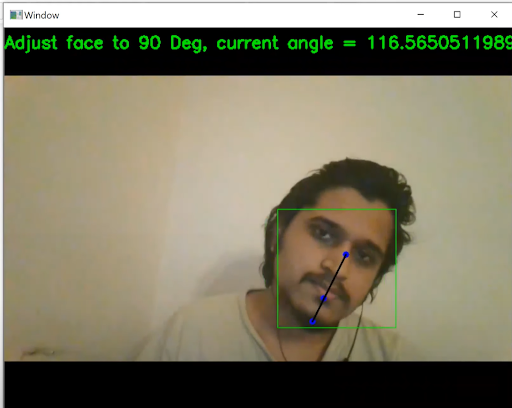
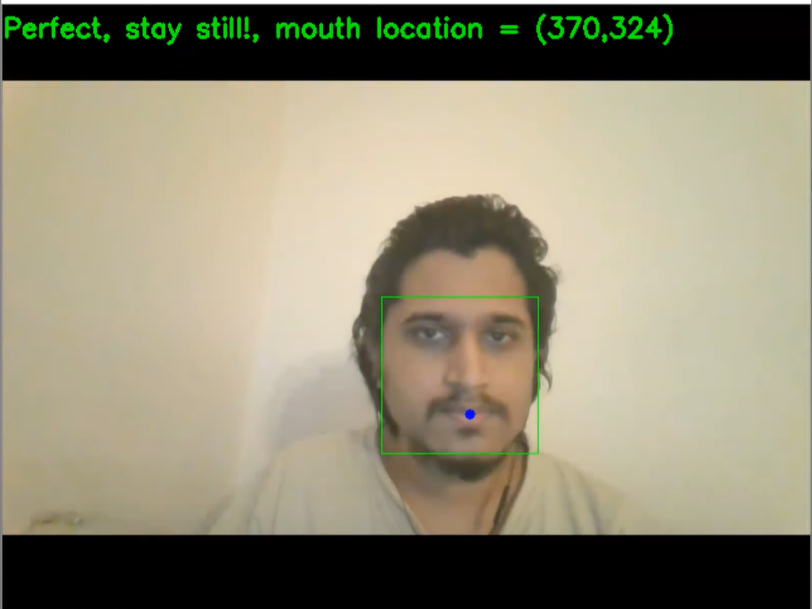

# Dlib-Face-Landmarks-Detection-and-Head-Pose-Adjustment
Sound Recognition and Face Detection based on Landmarks. It also suggests people to adjust the pose of their head.

This youtube video explains the work done - https://youtu.be/JuoVLzKDpCw

Download this file - https://drive.google.com/file/d/1wXu8zwdbVZSoYdWCpl3420WXdkJAuh_0/view?usp=sharing

And keep this file in the same folder as the python file while running it.

